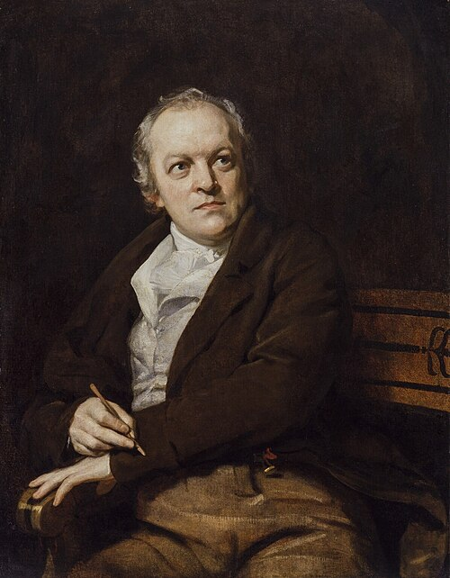
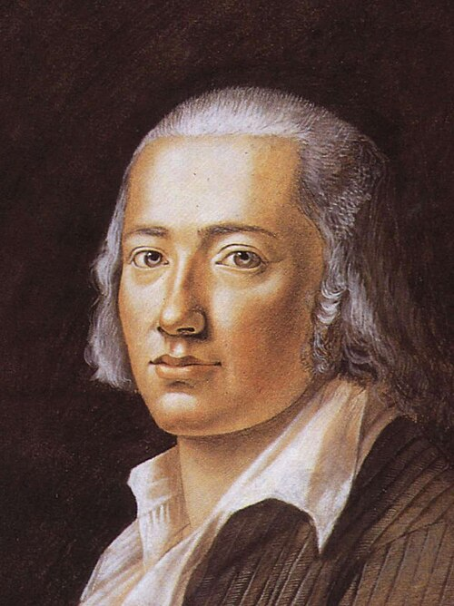
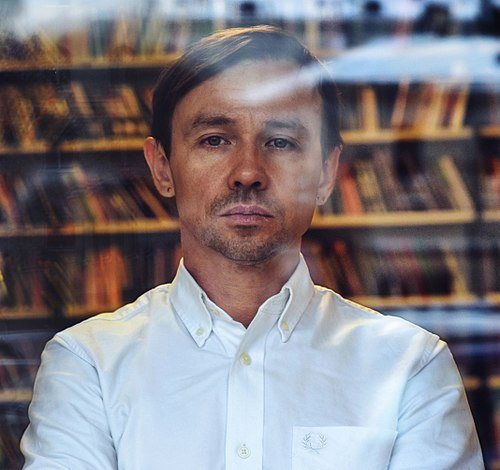

# Стихи

## Поэты и стихи

### Blake, William (1757–1827)

-

### Hölderlin, Friedrich (1770–1843)

-

### Лысиков, Андрей (р. 1971)

«Кровь изумрудная на землю хлынула...» (2014)

Кровь изумрудная на землю хлынула
Это солнце вспороло весне брюхо
Короткий нож ночей вынуло
Соловьиной спицей проткнуло ухо

Собрало на горле пальцев золото
Душит сон мой в самом начале
Проснусь — уберу в кобуру сердца холода
Ржавеющие печали

Лопнет лета зелёная кожа
Сверкнёт глубиною цветочная рана
Станет смерть ещё на один лепесток моложе
Облетающего тюльпана

Вздрогнет крылом птенца небо
Уронит на землю голубые крохи
Вырвутся из травы плена
К облакам
васильков вздохи

Выкипит льдинкой лето
На жарких детских ладонях
Созреет колосьями лунного света
В дождях проливных утонет

И полетят по остывающим небесам
Дней сентября лоскуты золотые
А дальше… Ты знаешь сам
Осень… Глаза пустые…

Я пью из одуванчиков вино
В раю теперь зима
Пролью сквозь сердце лета волшебство
Сойду с ума

