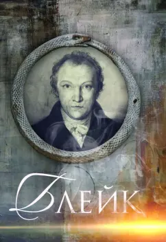
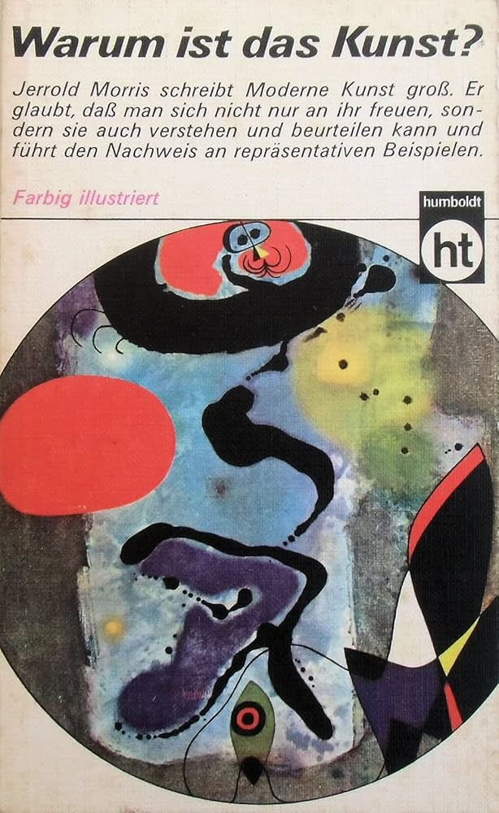
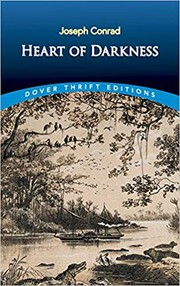
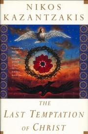
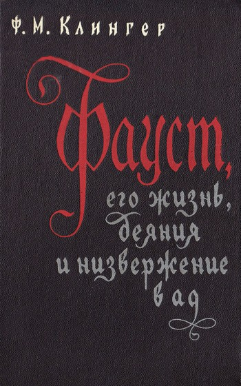
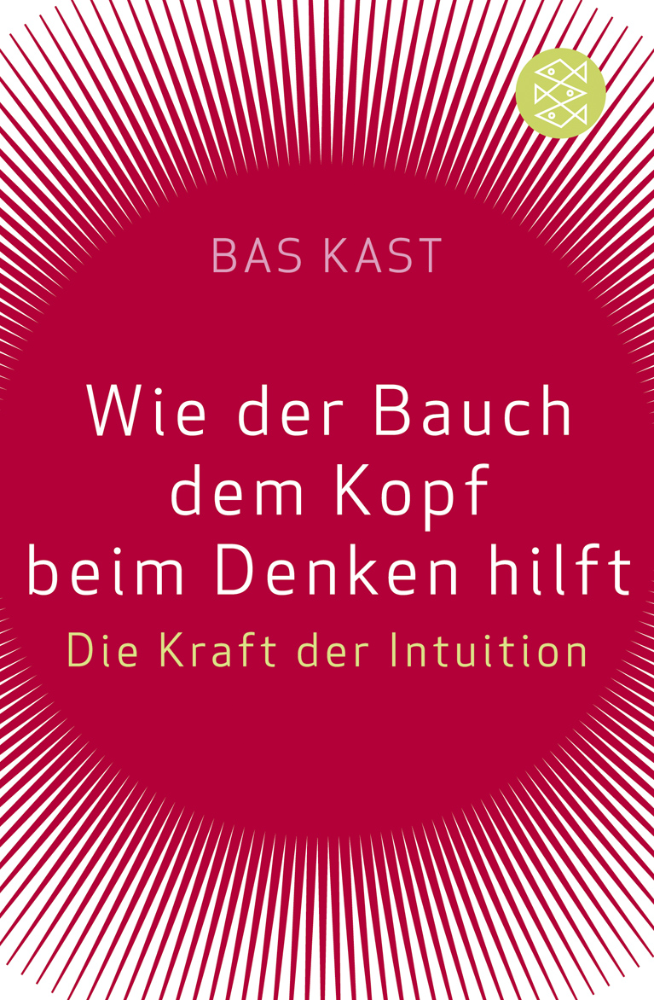

# Список чтения

## Читаю сейчас

| Обложка | Название | Автор | Год | ISBN | Начал |
|---------|----------|-------|-----|------|-------|
|  | Блейк. Биография. | Д. Смирнов-Садовский | 2017 | 978-5-9500498-0-4 | 2026-03 |
|  | Warum ist das Kunst? | Jerrold A. Morris | 1971 | — | 2026-03 |

## Хочу прочитать

| Название | Автор | Откуда узнал | Приоритет |
|----------|-------|--------------|-----------|
| Повелитель мух (Lord of the Flies) | Уильям Голдинг | | |

## Прочитано

| Обложка | Название | Автор | Год | ISBN | Дата прочтения | Краткое впечатление |
|---------|----------|-------|-----|------|----------------|---------------------|
|  | Сердце тьмы (Heart of Darkness) | Джозеф Конрад | 1899 | — | 2024 осень | |
|  | Последнее искушение Христа (Ο Τελευταίος Πειρασμός) | Никос Казандзакис | 1951 | — | 2025-09 | |
|  | Fausts Leben, Taten und Höllenfahrt | Friedrich Maximilian Klinger | 1791 | — | — | |
|  | Wie der Bauch dem Kopf beim Denken hilft. Die Kraft der Intuition | Bas Kast | 2009 | 978-3-596-17451-5 | 2026-01 | |

## Брошено

| Название | Автор | Почему бросил |
|----------|-------|---------------|
|          |       |               |
