# Список фильмов

## Хочу посмотреть

| Название | Год | Откуда узнал | Приоритет |
|----------|-----|--------------|-----------|
|          |     |              |           |

## Посмотрено и понравилось (71)

| Обложка | Название | Страна | Режиссёр | Год | Жанр |
|---------|----------|--------|----------|-----|------|
| 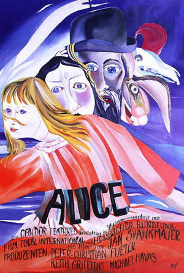 | Алиса (Něco z Alenky) | Чехословакия | Ян Шванкмайер | 1987 | Анимация, фэнтези |
|  | Ангел-истребитель (El ángel exterminador) | Мексика | Луис Бунюэль | 1962 | Драма, сюрреализм |
|  | Аниара (Aniara) | Швеция, Дания | Пелла Когерман, Хюго Лиа | 2018 | Sci-fi, драма |
|  | Апокалипсис сегодня (Apocalypse Now) | США | Фрэнсис Форд Коппола | 1979 | Драма, военный |
|  | Безумие (Šílení) | Чехия | Ян Шванкмайер | 2005 | Драма, хоррор |
|  | Бегущий по лезвию (Blade Runner) | США | Ридли Скотт | 1982 | Sci-fi, нуар |
|  | Бегущий по лезвию 2049 (Blade Runner 2049) | США | Дени Вильнёв | 2017 | Sci-fi, драма |
| 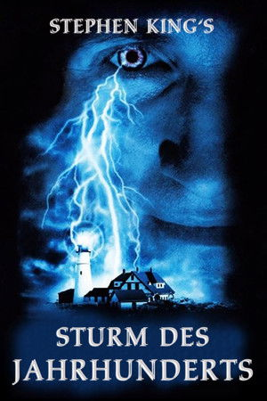 | Буря столетия (Storm of the Century) | США | Крейг Р. Бэксли | 1999 | Хоррор, триллер |
|  | В значит Вендетта (V for Vendetta) | США, Великобритания | Джеймс Мактиг | 2005 | Sci-fi, триллер |
| 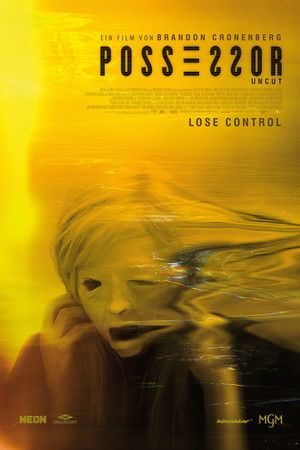 | В чужой шкуре (Possessor) | Канада | Брэндон Кроненберг | 2020 | Sci-fi, хоррор |
|  | Ванильное небо (Vanilla Sky) | США | Кэмерон Кроу | 2001 | Sci-fi, драма |
| 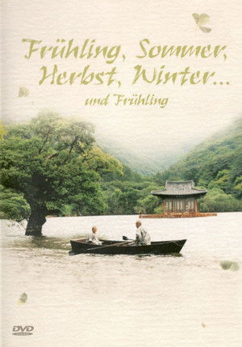 | Весна, лето, осень, зима… и снова весна (Spring, Summer, Fall, Winter... and Spring) | Южная Корея | Ким Ки Дук | 2003 | Драма |
|  | Визит инспектора (An Inspector Calls) | Великобритания | Эйслинг Уолш | 2015 | Драма |
| 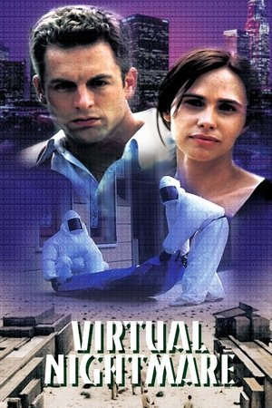 | Виртуальный кошмар (Virtual Nightmare) | Австралия | Майкл Паттинсон | 2000 | Sci-fi, триллер |
|  | Возможные миры (Possible Worlds) | Канада | Робер Лепаж | 2000 | Sci-fi, драма |
|  | Высшее общество (High Life) | Франция | Клер Дени | 2018 | Sci-fi, драма |
|  | Гаттака (Gattaca) | США | Эндрю Никкол | 1997 | Sci-fi, драма |
|  | Демон Лапласа (The Laplace's Demon) | Италия | Джордано Джултиви | 2017 | Sci-fi, триллер |
| 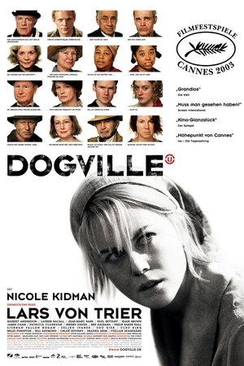 | Догвилль (Dogville) | Дания | Ларс фон Триер | 2003 | Драма |
|  | Донни Дарко (Donnie Darko) | США | Ричард Келли | 2001 | Sci-fi, драма |
|  | Другая Земля (Another Earth) | США | Майк Кэхилл | 2011 | Sci-fi, драма |
|  | Зло (Ondskan) | Швеция | Микаэль Хофстрём | 2003 | Драма |
|  | Игры разума (A Beautiful Mind) | США | Рон Ховард | 2001 | Драма, биография |
|  | Инцидент (El incidente) | Мексика | Исаак Эсбан | 2014 | Sci-fi, триллер |
|  | Исступление (Arrebato) | Испания | Иван Сулуэта | 1979 | Драма, хоррор |
| 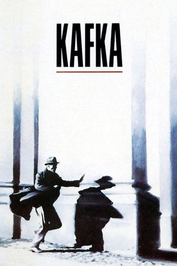 | Кафка (Kafka) | США | Стивен Содерберг | 1991 | Триллер, драма |
| 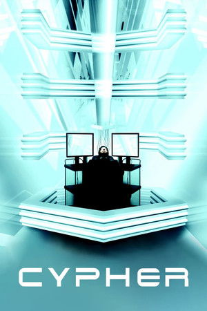 | Кодер (Cypher) | США | Винченцо Натали | 2002 | Sci-fi, триллер |
|  | Космическая одиссея 2001 (2001: A Space Odyssey) | США, Великобритания | Стэнли Кубрик | 1968 | Sci-fi |
| 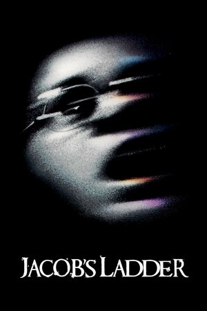 | Лестница Иакова (Jacob's Ladder) | США | Эдриан Лайн | 1990 | Триллер, хоррор |
| 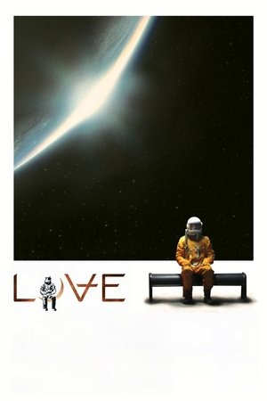 | Любовь (Love) | США | Уильям Юбэнк | 2011 | Sci-fi, драма |
| 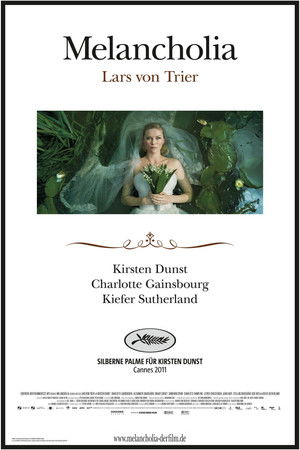 | Меланхолия (Melancholia) | Дания | Ларс фон Триер | 2011 | Sci-fi, драма |
| 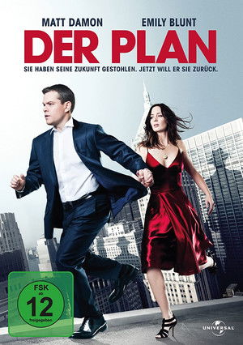 | Меняющие реальность (The Adjustment Bureau) | США | Джордж Нолфи | 2011 | Sci-fi, триллер |
|  | Место встречи (The Place) | Италия | Паоло Дженовезе | 2017 | Драма |
|  | Мёбиус (Moebius) | Аргентина | Густаво Москера | 1996 | Sci-fi, триллер |
|  | Мужчина, глядящий на юго-восток (Hombre mirando al sudeste) | Аргентина | Элисео Субьела | 1986 | Sci-fi, драма |
| 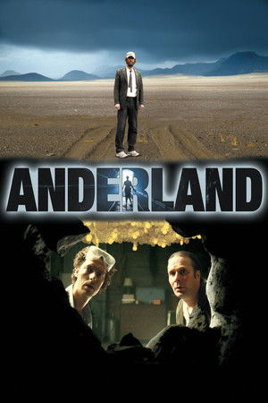 | Неуместный человек (Den Brysomme mannen) | Норвегия | Йенс Лиен | 2006 | Драма, sci-fi |
|  | Останься (Stay) | США | Марк Форстер | 2005 | Триллер, драма |
|  | Открой глаза (Abre los ojos) | Испания | Алехандро Аменабар | 1997 | Sci-fi, триллер |
|  | Открытие (The Discovery) | США | Чарли Макдауэлл | 2017 | Sci-fi, драма |
|  | Отражающая кожа (The Reflecting Skin) | Великобритания | Филип Ридли | 1990 | Драма, хоррор |
|  | Патруль времени (Predestination) | Австралия | Питер и Майкл Шпириг | 2014 | Sci-fi, триллер |
| 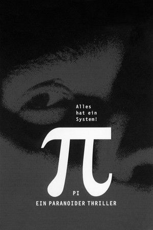 | Пи (Pi) | США | Даррен Аронофски | 1997 | Триллер, sci-fi |
|  | Пикник у Висячей скалы (Picnic at Hanging Rock) | Австралия | Питер Уир | 1975 | Драма, мистика |
| 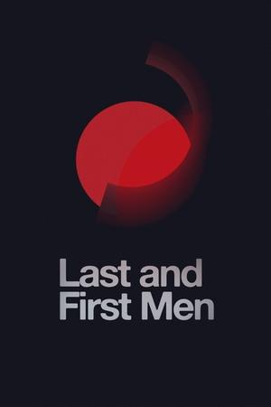 | Последние и первые люди (Last and First Men) | Исландия | Йоханн Йоханнссон | 2020 | Sci-fi, драма |
|  | Последнее искушение Христа (The Last Temptation of Christ) | США | Мартин Скорсезе | 1988 | Драма |
|  | Последняя волна (The Last Wave) | Австралия | Питер Уир | 1977 | Триллер, мистика |
| 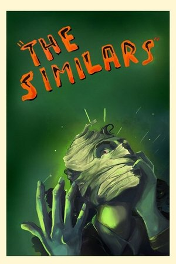 | Похожие (Los parecidos) | Мексика | Исаак Эсбан | 2015 | Sci-fi, хоррор |
| 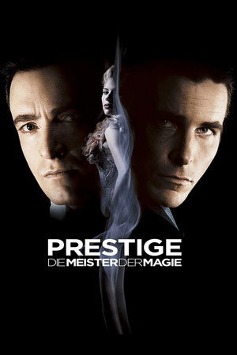 | Престиж (The Prestige) | США, Великобритания | Кристофер Нолан | 2006 | Sci-fi, триллер |
|  | Приговор (The Winslow Boy) | США, Великобритания | Дэвид Мэмет | 1999 | Драма |
|  | Призрак в доспехах (Ghost in the Shell) | Япония | Мамору Осии | 1995 | Sci-fi, аниме |
|  | Призрак в доспехах 2: Невинность (Ghost in the Shell 2: Innocence) | Япония | Мамору Осии | 2004 | Sci-fi, аниме |
|  | Приглашение (The Invitation) | США | Кэрин Кусама | 2015 | Триллер, драма |
|  | Примесь (Upstream Color) | США | Шейн Каррут | 2013 | Sci-fi, драма |
|  | Пудра (Powder) | США | Виктор Сальва | 1995 | Драма, фэнтези |
|  | Револьвер (Revolver) | Великобритания, Франция | Гай Ричи | 2005 | Триллер, криминал |
| 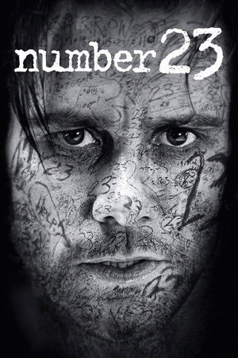 | Роковое число 23 (The Number 23) | США | Джоэл Шумахер | 2006 | Триллер |
|  | Семь (Se7en) | США | Дэвид Финчер | 1995 | Триллер, криминал |
| 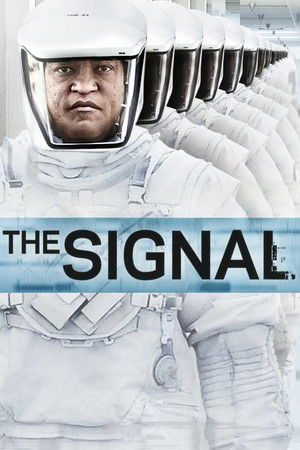 | Сигнал (The Signal) | США | Уильям Юбэнк | 2014 | Sci-fi, триллер |
| 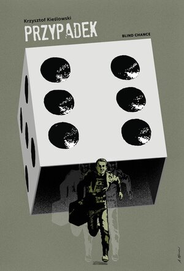 | Случай (Przypadek) | Польша | Кшиштоф Кесьлёвский | 1981 | Драма |
|  | Сталкер (Stalker) | СССР | Андрей Тарковский | 1979 | Sci-fi, драма |
|  | Стена (Pink Floyd: The Wall) | Великобритания | Алан Паркер | 1982 | Драма, музыкальный |
|  | Страховщик (Autómata) | Испания | Габе Ибаньес | 2014 | Sci-fi, триллер |
| 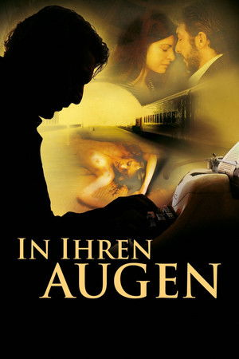 | Тайна в его глазах (El secreto de sus ojos) | Аргентина | Хуан Хосе Кампанелья | 2009 | Триллер, драма |
|  | Тёмный город (Dark City) | Австралия, США | Алекс Пройас | 1998 | Sci-fi, нуар |
|  | Тот самый Мюнхгаузен | СССР | Марк Захаров | 1979 | Комедия, фэнтези |
| 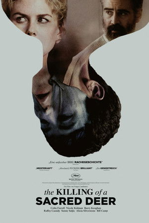 | Убийство священного оленя (The Killing of a Sacred Deer) | Великобритания, Ирландия | Йоргос Лантимос | 2017 | Триллер, драма |
| 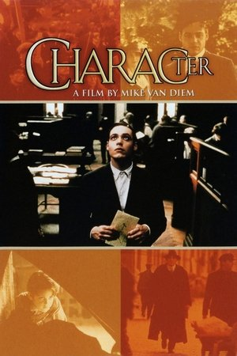 | Характер (Karakter) | Нидерланды | Мике ван Дим | 1997 | Драма |
|  | Человек с Земли (The Man from Earth) | США | Ричард Шенкман | 2007 | Sci-fi, драма |
|  | Человек, который спит (Un homme qui dort) | Франция | Бернар Кейсан, Жорж Перек | 1974 | Драма |
|  | Чайка по имени Джонатан Ливингстон (Jonathan Livingston Seagull) | США | Холл Бартлетт | 1973 | Драма |
| 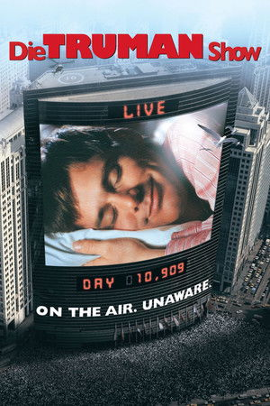 | Шоу Трумана (The Truman Show) | США | Питер Уир | 1998 | Sci-fi, драма |
