# Список фильмов

## Хочу посмотреть

| Название | Год | Откуда узнал | Приоритет |
|----------|-----|--------------|-----------|
|          |     |              |           |

## Посмотрено

| Обложка | Название | Режиссёр | Год | Жанр | Краткое впечатление |
|---------|----------|----------|-----|------|---------------------|
| 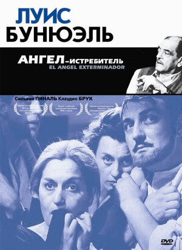 | Ангел-истребитель (El ángel exterminador) | Луис Бунюэль | 1962 | Драма, сюрреализм | |
| 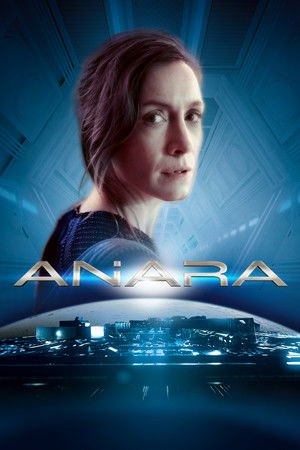 | Аниара (Aniara) | Пелла Когерман, Хюго Лиа | 2018 | Sci-fi, драма | |
| 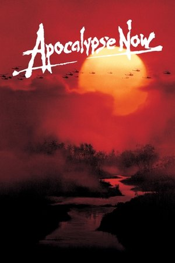 | Апокалипсис сегодня (Apocalypse Now) | Фрэнсис Форд Коппола | 1979 | Драма, военный | |
| 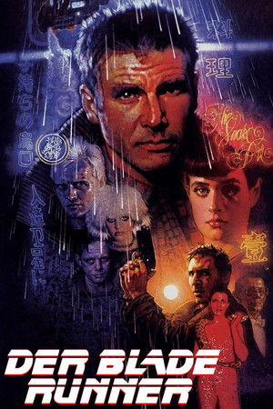 | Бегущий по лезвию (Blade Runner) | Ридли Скотт | 1982 | Sci-fi, нуар | |
| 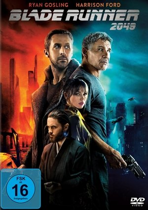 | Бегущий по лезвию 2049 (Blade Runner 2049) | Дени Вильнёв | 2017 | Sci-fi, драма | |
| 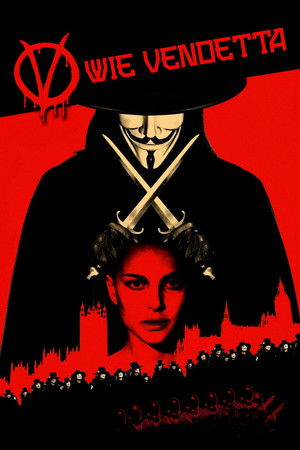 | В значит Вендетта (V for Vendetta) | Джеймс Мактиг | 2005 | Sci-fi, триллер | |
| 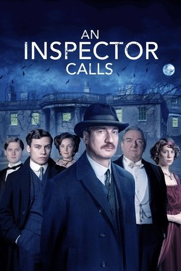 | Визит инспектора (An Inspector Calls) | Эйслинг Уолш | 2015 | Драма | |
| 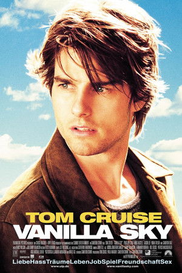 | Ванильное небо (Vanilla Sky) | Кэмерон Кроу | 2001 | Sci-fi, драма | |
| 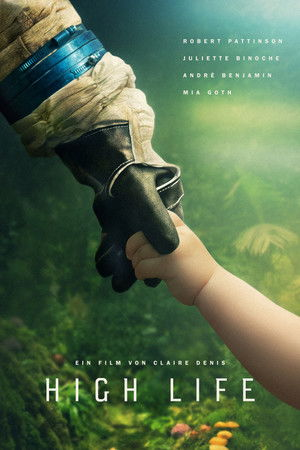 | Высшее общество (High Life) | Клер Дени | 2018 | Sci-fi, драма | |
| 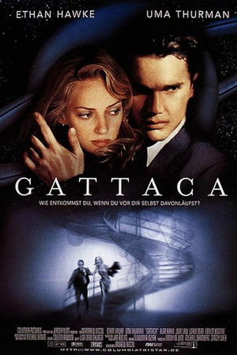 | Гаттака (Gattaca) | Эндрю Никкол | 1997 | Sci-fi, драма | |
| 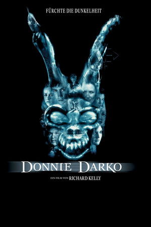 | Донни Дарко (Donnie Darko) | Ричард Келли | 2001 | Sci-fi, драма | |
| 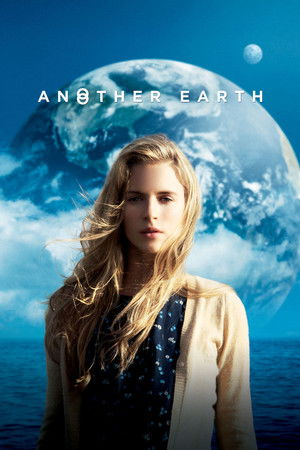 | Другая Земля (Another Earth) | Майк Кэхилл | 2011 | Sci-fi, драма | |
| 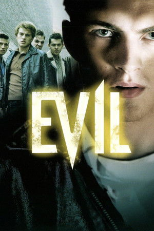 | Зло (Ondskan) | Микаэль Хофстрём | 2003 | Драма | |
| 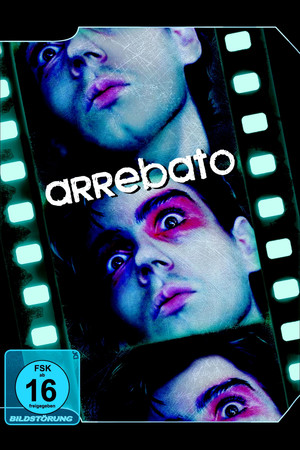 | Исступление (Arrebato) | Иван Сулуэта | 1979 | Драма, хоррор | |
| 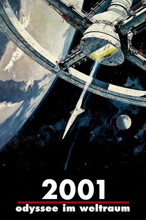 | Космическая одиссея 2001 (2001: A Space Odyssey) | Стэнли Кубрик | 1968 | Sci-fi | |
|  | Место встречи (The Place) | Паоло Дженовезе | 2017 | Драма | |
| 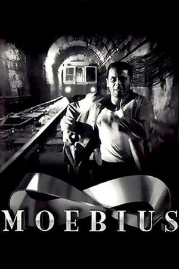 | Мёбиус (Moebius) | Густаво Москера | 1996 | Sci-fi, триллер | |
| 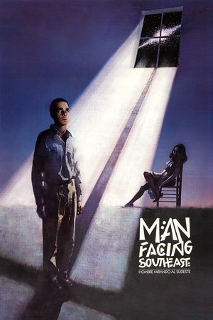 | Мужчина, глядящий на юго-восток (Hombre mirando al sudeste) | Элисео Субьела | 1986 | Sci-fi, драма | |
| 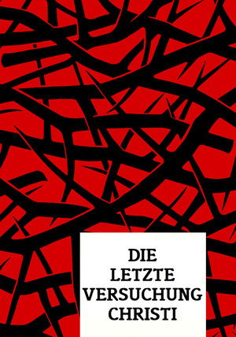 | Последнее искушение Христа (The Last Temptation of Christ) | Мартин Скорсезе | 1988 | Драма | |
| 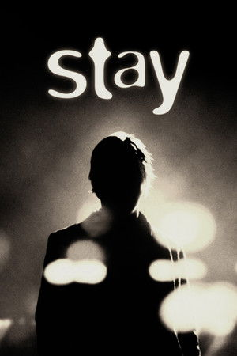 | Останься (Stay) | Марк Форстер | 2005 | Триллер, драма | |
| 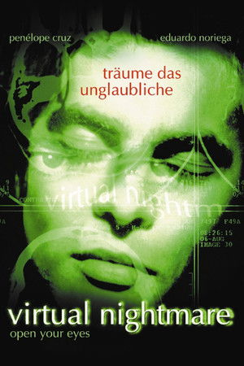 | Открой глаза (Abre los ojos) | Алехандро Аменабар | 1997 | Sci-fi, триллер | |
| 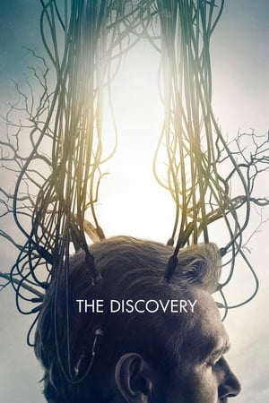 | Открытие (The Discovery) | Чарли Макдауэлл | 2017 | Sci-fi, драма | |
| 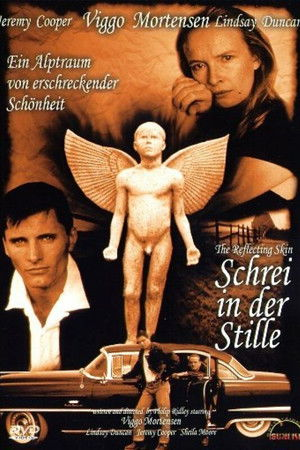 | Отражающая кожа (The Reflecting Skin) | Филип Ридли | 1990 | Драма, хоррор | |
| 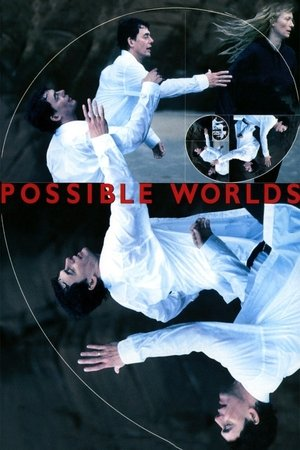 | Возможные миры (Possible Worlds) | Робер Лепаж | 2000 | Sci-fi, драма | |
| 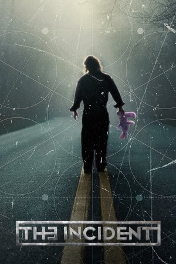 | Инцидент (El incidente) | Исаак Эсбан | 2014 | Sci-fi, триллер | |
| 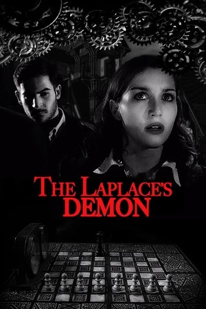 | Демон Лапласа (The Laplace's Demon) | Джордано Джултиви | 2017 | Sci-fi, триллер | |
| 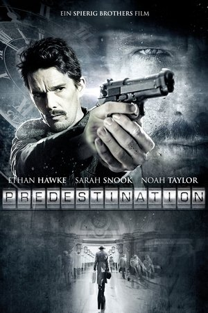 | Патруль времени (Predestination) | Питер и Майкл Шпириг | 2014 | Sci-fi, триллер | |
| 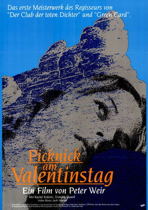 | Пикник у Висячей скалы (Picnic at Hanging Rock) | Питер Уир | 1975 | Драма, мистика | |
| 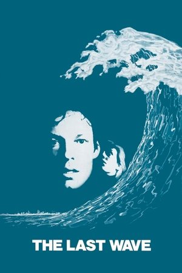 | Последняя волна (The Last Wave) | Питер Уир | 1977 | Триллер, мистика | |
| 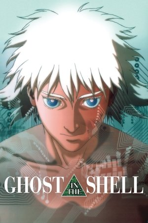 | Призрак в доспехах (Ghost in the Shell) | Мамору Осии | 1995 | Sci-fi, аниме | |
| 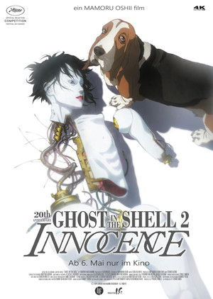 | Призрак в доспехах 2: Невинность (Ghost in the Shell 2: Innocence) | Мамору Осии | 2004 | Sci-fi, аниме | |
| 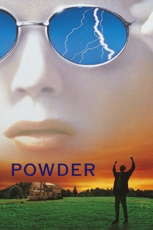 | Пудра (Powder) | Виктор Сальва | 1995 | Драма, фэнтези | |
| 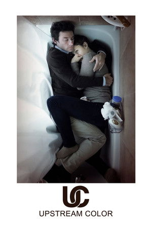 | Примесь (Upstream Color) | Шейн Каррут | 2013 | Sci-fi, драма | |
| 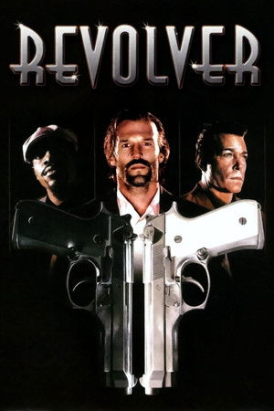 | Револьвер (Revolver) | Гай Ричи | 2005 | Триллер, криминал | |
| 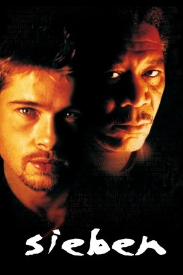 | Семь (Se7en) | Дэвид Финчер | 1995 | Триллер, криминал | |
| 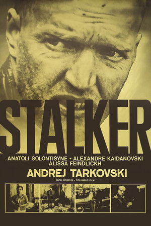 | Сталкер (Stalker) | Андрей Тарковский | 1979 | Sci-fi, драма | |
| 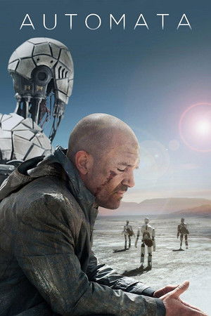 | Страховщик (Autómata) | Габе Ибаньес | 2014 | Sci-fi, триллер | |
| 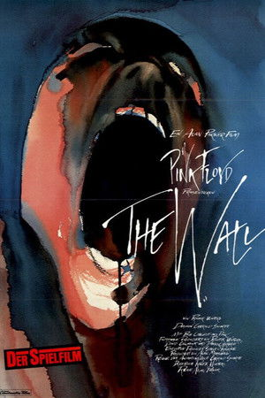 | Стена (Pink Floyd: The Wall) | Алан Паркер | 1982 | Драма, музыкальный | |
| 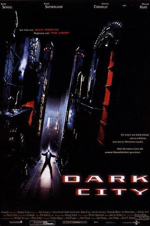 | Тёмный город (Dark City) | Алекс Пройас | 1998 | Sci-fi, нуар | |
| 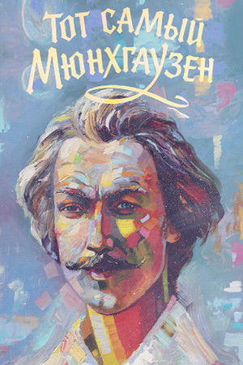 | Тот самый Мюнхгаузен | Марк Захаров | 1979 | Комедия, фэнтези | |
| 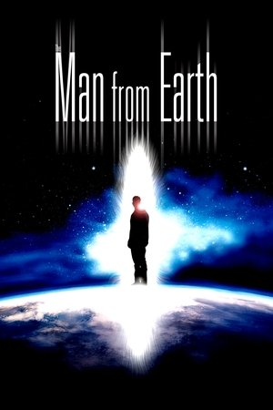 | Человек с Земли (The Man from Earth) | Ричард Шенкман | 2007 | Sci-fi, драма | |
| 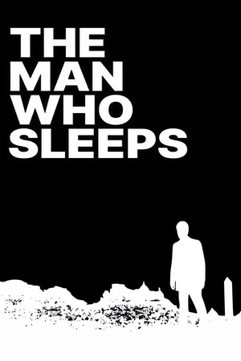 | Человек, который спит (Un homme qui dort) | Бернар Кейсан, Жорж Перек | 1974 | Драма | |
| 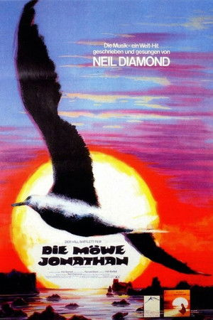 | Чайка по имени Джонатан Ливингстон (Jonathan Livingston Seagull) | Холл Бартлетт | 1973 | Драма | |
