# Музыка

## Альбомы

| Обложка | Исполнитель | Альбом | Год | Жанр |
|---------|-------------|--------|-----|------|
| 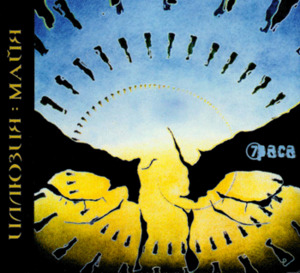 | 7раса | Иллюзия: Майя | 2006 | Alternative rock |
| 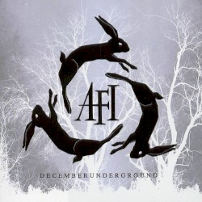 | AFI | Decemberunderground | 2006 | Alternative rock, post-punk |
| 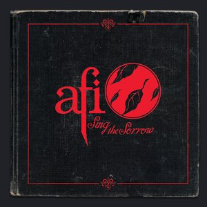 | AFI | Sing the Sorrow | 2003 | Post-hardcore, gothic rock |
| 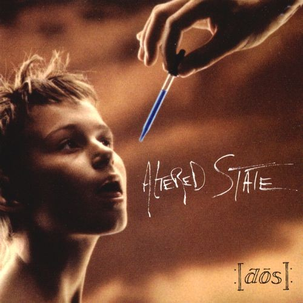 | Altered State | :[dos]: | 1993 | Alternative rock |
| 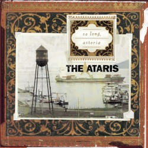 | Ataris, The | So Long, Astoria | 2003 | Pop punk |
| 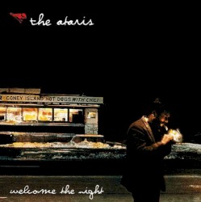 | Ataris, The | Welcome the Night | 2007 | Alternative rock |
| 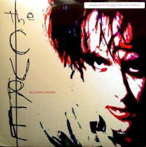 | Cure, The | Bloodflowers | 2000 | Alternative rock, gothic rock |
|  | DeadKedы | Ganeша | 2007 | Alternative rock, emocore |
| 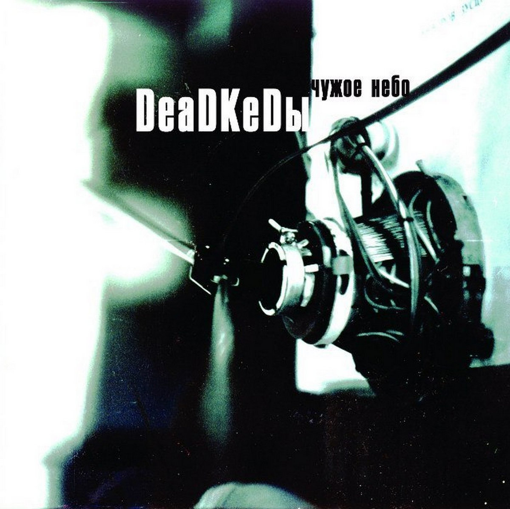 | DeadKedы | Чужое Небо | 2004 | Alternative rock |
| 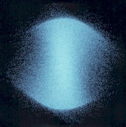 | Deafheaven | Infinite Granite | 2021 | Shoegaze, dream pop |
| 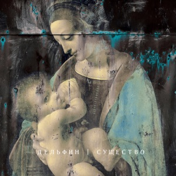 | Dolphin (Дельфин) | Существо | 2011 | Alternative, electronic |
| 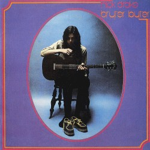 | Drake, Nick | Bryter Layter | 1971 | Folk, singer-songwriter |
| 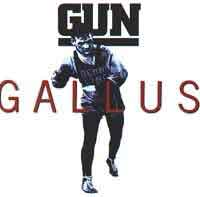 | Gun | Gallus | 1992 | Hard rock |
|  | Gun | Taking on the World | 1989 | Hard rock |
| 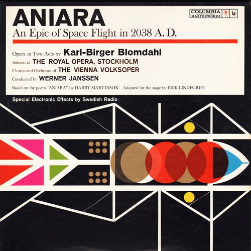 | Blomdahl, Karl-Birger | Aniara (дир. Werner Janssen) | 1960 | Opera, electronic |
|  | Blomdahl, Karl-Birger | Aniara (дир. Stig Westerberg) | 1985 | Opera, electronic |
| 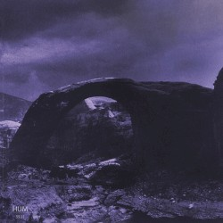 | Hum | Inlet | 2020 | Shoegaze, alternative metal |
| 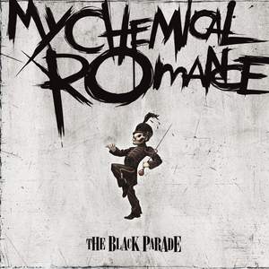 | My Chemical Romance | The Black Parade | 2006 | Alternative rock, post-hardcore |
| 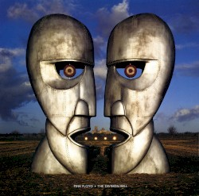 | Pink Floyd | The Division Bell | 1994 | Progressive rock |
| 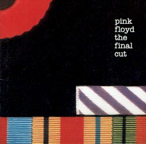 | Pink Floyd | The Final Cut | 1983 | Progressive rock |
|  | Stigmata | Основано на реальных событиях | 2012 | Nu-metal, metalcore |

## Песни

| Исполнитель | Песня | Альбом | Год |
|-------------|-------|--------|-----|
| Ataris, The | 12.15.10 | Silver Turns to Rust | 2017 |
| Ataris, The | Car Song | Car Song (single) | 2025 |
| Ataris, The | Fast Times at Dropout High | Silver Turns to Rust | 2017 |
| Ataris, The | The Graveyard of the Atlantic | Silver Turns to Rust | 2017 |
| Ataris, The | The Night That the Lights Went Out in NYC | Spider-Man 2 OST | 2004 |
| Bandits, Die | Catch Me | Bandits OST | 1997 |
| Catherine Wheel | Black Metallic | Ferment | 1991 |
| Catherine Wheel | Broken Nose | Adam and Eve | 1997 |
| Deafheaven | Honeycomb | Ordinary Corrupt Human Love | 2018 |
| Deafheaven | The Marvelous Orange Tree | Lonely People with Power | 2025 |
| Deafheaven | Winona | Lonely People with Power | 2025 |
| Modern English | Ink and Paper | Stop Start | 1986 |
| Roe, Kris | Soul and Fire | Hang Your Head in Hope | 2019 |
| Siouxsie and the Banshees | Spellbound | Juju | 1981 |
